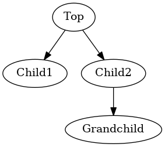
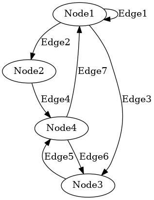

# JSON Representation for Graphs

## Introduction

This is a brief report on the considerations related to and explorations of
various JSON representations for general graphs. Our considerations and
requirements are listed below and we hope to find ready-made solutions in the
form of accepted and popular formats on the internet or decide to adopt the
best practices and modify them to our own needs.

## Goal

Our primary goal is to
find a good JSON representation for graphs that are of interest in the area
of source code analysis and compilation. Of particular interest are: control
flow graph, data flow graph, call graph, AST, and other structured data that
has an underlying graph or tree model.
We hope that one format will fit them all.

## Requirements/concerns:

First and foremost we like to keep everything simple. The format should be
easy to understand by humans and computers, and easy to produce.
It should use a small set of explicit "key"-words, like `"nodes"`, `"edges"`, etc.
Especially for graphs, it is important to represent edges explicitly.
They typically have a type and other attributes that are of importance.
We are fine with having either all edges being directed or all undirected,
so that should be an attribute of the graph and not per edge.
On the other hand, we do foresee multiple distinct edges between the same pair
of nodes; so that feature must be representable. Another trade-mark of
simplicity is that there is no redundant information and a particular fact is
expressed in one way only.

For certain applications it is important that the order of some objects can be
relied upon. In JSON that means using arrays instead of objects. It is nice
to output tree nodes in e.g. a depth-first order (and indicate so with an
attribute like `"order": "dfs"`), or specify that graph nodes are in topological
order. No matter, the representation must then be able to preserve that order.

We also want a format that is easily manipulated to enable conversions to and
from other formats (XML, GraphViz Dot).

Note that using JSON we will always need to use references:
JSON cannot natively express a graph (at most a tree) structure.
In an undirected graph we should allow for direction-agnostic references to
nodes,
like `"between": [ "node1", "node2" ]` (still ordered, if wanted);
in a directed graph we often see: `"source"` and `"target"` (or from/to or
tail/head).
Let's use the neutral term `"between"` for both.

Should a node be merely a key and its value or an object by itself?
Or, should a list of nodes be an array of objects?
Nodes and edges being JSON arrays gives a means for ordering them.
It will also be easier to select them as a group and iterate over the elements.

We should make a distinction between a node id (an identification used for
reference) and a node
label. The latter is human oriented; the id has only meaning
within the representation and could be a generated UUID.

Do edges need an id? For sure multi-edges do, to distinguish them somehow,
but that's application dependent.
But in JSON it is allowed to have array elements being identical, so even
without identification it is possible to represent multiple edges between the
same two nodes (they will then be indistinguishable except when they have
different attributes for instance). So let's leave edge ids optional.

A good way to steer the decision making process is to attempt to capture some
examples in the proposed format.

### Simple example of a tree in proposed format

This figure is represented by the JSON object below.


```json
{
  "graph": {
    "version": "1.0",
    "type": "tree",
    "directed": true,
    "root": 0,
    "nodes": [
      { "id": 0, "label": "Top" },
      { "id": 1, "label": "Child1" },
      { "id": 2, "label": "Child2" },
      { "id": 3, "label": "Grandchild" }
    ],
    "edges": [
      { "between": [ 0, 1 ] },
      { "between": [ 0, 2 ] },
      { "between": [ 2, 3 ] }
    ]
  }
}
```

Note that the `id`s are chosen to be integers and that they could be
consistently renamed without affecting the tree structure. The `root` property
indicates the root node of the tree whose `id` value equals its value, 0 in
this case.
The idea is also
that both node and edge objects can have many more attributes of any JSON
type. Only a few keys and their types are prescribed. All this will be
formally specified in a schema.

### Simple example of a directed graph in proposed format

This directed graph is represented by the JSON as follows.


```json
{
  "graph": {
    "version": "1.0",
    "directed": true,
    "nodes": [
      { "id": "Node1" },
      { "id": "Node2" },
      { "id": "Node3" },
      { "id": "Node4" }
    ],
    "edges": [
      { "between": [ "Node1", "Node1" ], "label": "Edge1" },
      { "between": [ "Node1", "Node2" ], "label": "Edge2" },
      { "between": [ "Node1", "Node3" ], "label": "Edge3" },
      { "between": [ "Node2", "Node4" ], "label": "Edge4" },
      { "between": [ "Node3", "Node4" ], "label": "Edge5" },
      { "between": [ "Node4", "Node3" ], "label": "Edge6" },
      { "between": [ "Node4", "Node1" ], "label": "Edge7" }
    ]
  }
}
```

Here we see that the original node names are used as `id`s and that edge names
are explicitly listed by the `label` attribute. Since the graph is `directed`
we know that the `between` array has to be considered ordered: the first
element is the node where the edge originates from and the second element is
the node where the edge ends up. It is tempting to completely remove the
`nodes` key and its value, since all nodes are known via the edges. However,
in most cases nodes will have more data associated and hence need to be listed
anyway. Therefore the `nodes` and `edges` keys will be deemed mandatory and
all references to nodes in the `edges` list must be mentioned also in the
`nodes` list. Not necessary the other way around since we allow for isolated
nodes in a graph.

### The minimum graph in proposed format

The example shows the minimum required keys and their values.
It happens to represent an empty (undirected) graph.

```json
{
  "graph": {
    "version": "1.0",
    "directed": false,
    "nodes": [],
    "edges": []
  }
}
```

### Alternative notation using a node adjacency list

Here is the same tree again but this time formulated using an adjacency style
notation where each node directly list its own `edges`. Since we have no
additional edge information, we allow the edges to merely consist of a list of
node `id`s. It is also assumed that absence of the `edges` means the same as
an empty list (`"edges": []`).

```json
{
  "graph": {
    "version": "1.0",
    "type": "tree",
    "directed": true,
    "root": 0,
    "nodes": [
      { "id": 0, "label": "Top",    "edges": [ 1, 2 ] },
      { "id": 1, "label": "Child1" },
      { "id": 2, "label": "Child2", "edges": [ 3 ] },
      { "id": 3, "label": "Grandchild" }
    ]
  }
}
```

The alternative notation for the graph example is as follows:

```json
{
  "graph": {
    "version": "1.0",
    "directed": true,
    "nodes": [
      { "id": "Node1",
        "edges": [ { "on": "Node1", "label": "Edge1" },
                   { "on": "Node2", "label": "Edge2" },
                   { "on": "Node3", "label": "Edge3" } ]
      },
      { "id": "Node2",
        "edges": [ { "on": "Node4", "label": "Edge4" } ]
      },
      { "id": "Node3",
        "edges": [ { "on": "Node4", "label": "Edge5" } ]
      },
      { "id": "Node4",
        "edges": [ { "on": "Node3", "label": "Edge6" },
                   { "on": "Node1", "label": "Edge7" } ]
      }
    ]
  }
}
```

## Observations

From scanning available JSON graph formats on the web, we learn that many follow
similar ideas as what the overall structure is concerned but deviate in the
details. The node and edge list approach is prevalent.
There are a few serious graph JSON formats that strive to become a standard
and that are backed by several organizations.
In principle it should be easy to convert between the formats,
so choosing the "wrong" one is not that bad.
Especially if we allow for additional properties in objects,
any schema can always be extended to allow insertion of missing or
additional information.
Of course our basic requirements still stand and must be expressible in the
format of choice.

## References consulted

> <a id="1">[1]</a>
[jsongraphformat](https://jsongraphformat.info/)

> <a id="2">[2]</a>
[jsongraph](https://github.com/jsongraph/json-graph-specification)

> <a id="3">[3]</a>
[jsongraphformat](https://jsongraphformat.info/v2.0/json-graph-schema.json)

> <a id="4">[4]</a>
[graphalchemist](https://graphalchemist.github.io/Alchemy/#/docs)

> <a id="5">[5]</a>
[graph-json](https://www.npmjs.com/package/graph-json)

## Appendix: IBM Graph JSON Schema

The JSON schema below defines the IBM AI4Code JSON Graph Format.
At the top-level there should be a JSON object with a `graph` property, which
itself must be an object. That object has several required properties, the
most important being the `nodes` and `edges` properties, both of which must be
arrays, thus guaranteeing an ordered list of items. The array elements are to be
objects. It is to be understood that applications that rely on for instance
the order of children nodes of a parent node, may assume that the (outgoing)
edges will occur in that order in the `edges` array. Node order may have a
significance too. For instance the `nodes` array might list the nodes in a
topological order. This can be specified using the `order` property.

All nodes and edges may have other properties beyond the required ones as
specified by the schema. If in the future these tend to be of general use, the
schema might be extended to include those and thereby formalize their
definition.

See: [graph-schema.json](graph-schema.json)

The alternative adjacency style can co-exist with the proposed node and edge
list schema. This has been captured in the following schema that is able to
validate both styles and even combinations of them in a single graph
description.

The key `on` is used as a neutral term to avoid `to` which suggests direction
but would not make much sense in an undirected graph.

See: [graph-schema-alt.json](graph-schema-alt.json)
